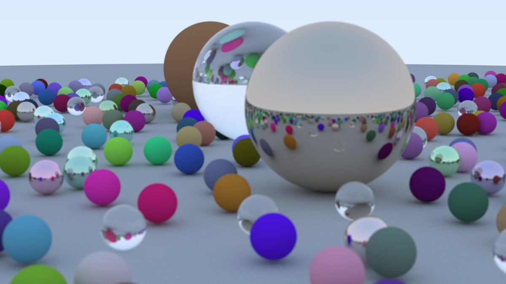

import IntegratedCanvas from "../../components/IntegratedCanvas.astro";
import Caption from "../../components/Caption.astro";
import Aside from "../../components/Aside.astro";

# Ray Tracing in One Weekend

A few months ago I was looking for something new to do and I came across [Ray Tracing in One Weekend](https://raytracing.github.io/books/RayTracingInOneWeekend.html). It looked like a fun little project to keep me entertained for a while. An engaging writing style, plenty of diagrams and visuals, and lots to actually do. As much as I enjoy reading about interesting projects and research that people come up with, it was refreshing to come across something where I could realistically follow along as I read. Anyways, with the additional challenge of translating the C++ examples to Rust, I embarked on the start of my ray tracing journey ... which lasted about a day.

<Caption>Final product after following Ray Tracing in One Weekend</Caption>

I did really enjoy going through the Ray Tracing in One Weekend book but once I got my teeth in it, it didn't take too long to complete. To be fair, there's a lot more content in [the rest of the series](https://raytracing.github.io/), all written in a similar style but I realised that I needed something more: speed. Every time I changed something, I would have to wait a couple of minutes to render the image and see the result and that started getting annoying quite quickly, especially as I knew there was a better way.

<Aside>
	Quickly before we get into it, I would like to apologise for any performance issues when on this page. I'm still working on how best to
	integrate interactive elements into blog posts but for now I have artificially limited everything to 10 fps in the hope that it won't tax
	lower power hardware too much.
</Aside>

# Graphics Programming

The renderer you create by the end of the book is single threaded which is the main performance bottleneck (on modern desktop CPUs) as only one pixel can be computed at a time. I could have set up multithreading so that the entire might of the CPU could be used to perform the render, instead of just a small fraction, but most computers these days have a component designed for this task - the GPU. Graphics Processing Units have a fundamentally different architecture from CPUs that allow them to essentially run heavily multithreaded software with tens or hundreds of thousands of threads (as opposed to the tens of threads on a good CPU). They can do this for reasons that I am still trying to get my head around. Suffice to say, this feature makes them perfect for generating pixel data and makes them the ideal tool for a ray tracer. (There are certain ray tracing renderers that cannot take advantage of the GPU architecture and perform best on the CPU but that's not what we're working on today).

Thankfully, some wonderful people have started on a port of the [Ray Tracing in One Weekend on a GPU](https://github.com/RayTracing/gpu-tracing). The problem was that I had never written single line of shader code and I wanted something of a foundation of knowledge before I took on a task like this. I noticed that the GPU book was using the Rust [wgpu](https://github.com/gfx-rs/wgpu) library and, after further research, I decided that this was the right tool to learn in this case. It's well maintained, has good documentation, and supports all the platforms that I could ever reasonably want to run on. It's also used in Firefox as of [version 141](https://mozillagfx.wordpress.com/2025/07/15/shipping-webgpu-on-windows-in-firefox-141/)!

It was time for a slight detour to learn wgpu. I found this [Learn Wgpu](https://sotrh.github.io/learn-wgpu/) guide that seemed like as good a starting point as anything else. As this was my first venture into graphics programming and rasterisation, it took me a little while to understand all the concepts but I would recommend this guide for anyone wanting to start off with wgpu.

<IntegratedCanvas id="triangle" colour="navy" />
<Caption>Interactive canvas with a GPU rendered triangle and a background colour based on mouse position</Caption>

With my first wgpu program under my belt, it was time to tackle ray tracing once again. To be fair, the GPU Ray Tracing book is intended as a starting point for learning GPU programming and wgpu but, when I was going through this in early 2025, it was incomplete and I found that following another tutorial beforehand helped fill the gaps in for me. It may be that at the time that you read this, you could skip the Learn Wgpu if you were to follow along.

<IntegratedCanvas id="gpu-port" colour="salmon" />
<Caption>Ray Tracing in One Weekend running on your GPU</Caption>

Anyways, the upfront work necessary to display anything was a lot higher now that I was using a graphics API but it was all worth it once the ray tracing renderer was up and running and I could now make changes in near realtime. This revelation opened up a world of possibilities for me, facilitated by the next books in the Ray Tracing in One Weekend series and by Sebastian Lague's [Coding Adventures](): "What if I want to render triangles too?" - ([Möller–Trumbore](https://en.wikipedia.org/wiki/M%C3%B6ller%E2%80%93Trumbore_intersection_algorithm)); "oh and what about if I want an object to emit light instead of getting all the light from the background?" - emissive materials; "I've heard about this [Bounding Volume Hierarchy (BVH)](https://en.wikipedia.org/wiki/Bounding_volume_hierarchy) thing, how would I do that?" - [Coding Adventure](), and "I have an idea, I wonder what it would look like if I could click on object and it would highlight them" - this one was a little more work as I needed to learn how to interact with the windowing API and input system but I'm happy with the result. Figuring out how to interact with the windowing API also opened up the possibilities for camera controls, which made the renderer so much more fun to play with.

<IntegratedCanvas id="gpu-port-modified" colour="aquamarine" />
<Caption>A renderer with a movable Camera, a BVH, emissive materials, triangles, spheres, and adjustable depth of field</Caption>

Even though with the number of objects and scenes that I was creating performance wasn't an issue, I was finding the optimisations fascinating. This is why I implemented BVH before it was strictly required. The problem was that there was one optimisation I had in mind that none of the documentation I was going through was answering. Ray Tracing has become quite the buzzword recently, especially in the context of graphics cards and hardware, and I am lucky enough to have a GPU with hardware Ray Tracing acceleration. How can I use this in my renderer?

# Vulkan

I had no idea at the time, but this single thought ballooned the scope of this little renderer more than pretty much any other idea I've had. It also opened up a world of possibilities that I'm worried I don't have the time to explore. As of writing this, wgpu didn't support hardware ray tracing and had no plans to add it so I had to go looking for another graphics API. I wanted to stick with an API that could be embedded into a website to make it easier to impose my creations upon other people but neither of the two major web graphics APIs (WebGL and WebGPU) support hardware ray tracing. This meant it was time to look at the big boy desktop graphics APIs.

There are three modern desktop graphics APIs: DirectX 12, Metal, and Vulkan. Historically OpenGL has also been an option, lots of software uses it and there is a big library of help available, but it appears to be getting slowly phased out and doesn't support newer features like hardware ray tracing. The latest version (4.6) was published in 2017 and the development team are no longer developing it. Part of this whole excercise is to learn useful skills and it wouldn't really make sense to learn a deprecated API, at least for a personal project. So, the big three. DirectX and Metal are the first party APIs for Windows and Apple platforms, respectively, and each only run on their platform. This makes my decision very easy. I do my development on Windows and Linux and the only cross platform option is Vulkan. It also supports Apple devices through the [MoltenVK](https://github.com/KhronosGroup/MoltenVK) project, which is nice to keep in mind for the future although I don't plan on support Apple devices until [this issue](https://github.com/KhronosGroup/MoltenVK/issues/427) is closed and support for hardware ray tracing is added to MoltenVK.

I did a lot of reading around before comitting to start anything and the consensus appeared to be that Vulkan was a behemoth and the learning curve would be steep. I mentioned earlier how using wgpu required a lot more work to set everything up before I could start creating images. This would be so much worse. Or so the internet made it seem. Surely these reports were exaggerated. I'm a software engineer, how hard could it be?

I did consider using a Vulkan wrapper like [Vulkano](https://github.com/vulkano-rs/vulkano) but I decided that if I was going to take the plunge and learn Vulkan, I might as well learn the actual API instead of an abstraction layer and then I should hopefully develop some more general knowledge and should have more resources to learn from. Regardless, at the end of the day this is a personal project and if I want to spend months studying documentation, no-one can stop me.

<Aside title="The Triangle">
	As an aside, one thing I learned during this journey is that the graphical programming equivalent of a "Hello World" application is
	displaying a plain coloured triangle. I'm quite familiar with using a "Hello World" printout as a starting point for software and blinking
	an LED for firmware but I can't say I'd considered what the ubiquitous basic program would be if the desired output was a display. A
	thought that came to me is that an interesting benchmark that could be used with the triangle, or even Hello World or Blinky, is how long
	it takes to write the software. There are many approaches that could be taken: physical time taken from a clean project or clean system,
	or number of keyboard inputs or characters required. You could even make a Docker image starting from the same base and compare size of
	the dockerfile. Anyways, that's something for another time. At the moment it's time to discover what led to this train of thought.
</Aside>

## Ash

After all that reading and deciding, the chosen tool was the [Ash](https://github.com/ash-rs/ash) Rust crate and the task at hand was to display a triangle on the screen. Vulkan is written in C but is designed to be used in whatever language you want. Khronos does this by providing the [_vk.xml_](https://raw.githubusercontent.com/KhronosGroup/Vulkan-Docs/main/xml/vk.xml) file which is a machine readable description of the entire Vulkan specification. One can write some software to parse this and create bindings to the Vulkan API in whatever language the heart desires. This is what Ash is, making it pretty much as thin of a layer as possible around the Vulkan API to be able to use it in Rust. This makes it great for taking advantage of the large quantity of public Vulkan documentation, projects, and forum posts that are written in C and C++ as all the API calls are very similar. The main downside is that Vulkan requires the user to perform all the memory handling which means a lot of it is unsafe Rust. But I hadn't really done unsafe Rust before and I welcomed the challenge. On the hunt for a good starting point, I came across a few well regarded tutorials for learning Vulkan but I ended up going with the [Vulkan Tutorial](https://vulkan-tutorial.com/) by Alexander Overvoorde. This guide is written in C++ but can be used for the Vulkan bindings in any language. That being said, I did find a couple of projects that had the completed source for the tutorial in Rust using Ash. Namely [adrien-ben](https://github.com/adrien-ben/vulkan-tutorial-rs) and [unknownue's](https://github.com/unknownue/vulkan-tutorial-rust/) GitHub repositories. These were incredibly valuable when it came to setting up elements that are out of scope of the Vulkan API like the window itself and inputs. Even though the Vulkan calls are all very similar between programming languages, the window libraries can be very different so the initial setup of the Vulkan project can be unique to the langiage/libraries chosen.

And so I set about trying to display a triangle. For reference, it took me about an hour to display a shape when rendering on the CPU and about a day to show the triangle using wgpu. Ash took me a week. This isn't to say I didn't enjoy it or that I wouldn't recommend doing the same - on the contrary, it was really interesting delving into this new world and it felt quite rewarding seeing that little red triangle. The tutorial goes on to show how to set up a basic 3D scene with some lighting, mipmapped textures, and an imported model. These were interesting too but not really relevant for what I wanted to do at the time.

I now had a functioning Vulkan based application on my hands. It wasn't very capable but it did make for a good starting point. On that point, it didn't take _too_ much work to modify the ray tracing shaders from the wgpu renderer and set up the vulkan renderer to use them. One of the unique things about Vulkan is that it doesn't define its own shader language, instead it uses an Intermediate Representation called [SPIR-V](https://www.khronos.org/spirv/) - The Standard Portable Intermediate Representation for Vulkan. This means that the shaders can be written in whatever language you please, as long as it can compile into SPIR-V. So for our use case, we could use the WGSL shaders from wgpu and compile them to work with Vulkan.

# Hardware Ray Tracing

Even though I had ray tracing working again, I had still not reached my goal of hardware ray tracing. I'm going to give you a brief summary of the details for now because I've got other things I have to do today but suffice to say that this took a while.

## VK_KHR_ray_tracing_pipeline and co.

The Vulkan API specification is divided into core features and extensions. All devices that support Vulkan **must** support the core features of whatever Vulkan version they claim to support and can support any number of extensions they want. The Khronos Group (the maintainers of Vulkan) publish their own official extensions which are prefixed with **KHR\_** and multivendor extensions prefixed with **EXT\_**, but anyone can add their own extensions. For example, Nvidia, AMD, and Google have extensions with the **NV\_**, **AMD\_**, and **GOOGLE\_** prefixes, respectively. The ideal life cycle for an extension is that it gets published as a proprietary extensions, other members recognise its value and agree to support it, republishing it with **EXT\_** instead. After some time, if it is determined to be stable, well supported, and not conflict with other official extensions, it could get ratified into an official **KHR\_** extension. Finally, the members of the consortium can vote to _promote_ an extension to core status, meaning that all future versions of Vulkan (and hardware supporting it) will have access to that feature. Now it's not necessarily as simple as that as if there is an emergent demand for a feature among multiple vendors, an extension/feature can pop up at any point in the chain, but this is the gist of the Vulkan extension ecosystem, as I understand them.

At the time of writing this, ray tracing in Vulkan is performed using **KHR** extensions. There are two main types of supported ray tracing, the Ray Tracing Pipeline using _VK_KHR_ray_query_ (for generating an entirely ray traced image), and Ray Queries using _VK_KHR_ray_tracing_pipeline_ (generally for performing a small number of rays for a simple purpose, although it's a little more complicated than that). Both of these make use of _VK_KHR_acceleration_structure_. The Acceleration Structure is the core of what makes real time ray tracing possible and the actual implementation is a closely guarded secret by each hardware vendor. That being said, I read [a great analysis of the different implementations](https://zeux.io/2025/03/31/measuring-acceleration-structures/). The BVH \[TODO: internal links\] I mentioned earlier is a rudimentary implementation of an Acceleration Structure but it's essentially a big a data structure that allows a ray to check if it has hit something without looping through all objects in the scene.

## The Graphics Pipeline for Ray Tracing

To get a bit technical, my software ray tracing solution was originally performed in the fragmentation stage of the graphics pipeline with the vertex stage being used to generate a single big rectangle tha covers the screen. At its most basic, these two stages are all that is needed to have yourself an image to display. Every time a frame is requested, you set the GPU to compute the vertex shader (that computes the screen space coordinates for all the objects in the scene), then the fragment shader (that colours in the objects processed by the vertex shader), then display the output image. This is a simple solution because the graphics card only has to be doing one block of computation at the time, either generating the viewport or performing the ray tracing.

## TODO: Insert a diagram of stages

The problem with this is that the hardware ray tracing can't be performed in either of these stages. The ray tracing stage is a distinct process that needs to be set up and run separately. In my case, the purpose of this stage is to take the acceleration structure and produce an image with the camera's view of the scene. This image can then be used by the fragmentation shader to be displayed on the vertices provided by the vertex shader (i.e. shown on the display). Now, although the ray tracing shader can be essentially inserted into the standard vertex + fragmentation shader pipeline, there's a new topic we need to discuss.

<Aside title="Async Compute">
	You may be familiar with how CPUs support multithreading where multiple pieces of software can be running at the same time and hardware
	resources can be distributed between them so that one can run while the other is waiting on something or both can run simultaneously if
	the hardware can support this. GPUs support a similar feature in the form of queues. A queue contains a list of commands that you want the
	GPU to execute on after the other. For example, the typical rasterisation pipeline can be run in a single queue where the vertices are
	generated, coloured, and then copied into the swapchain to be displayed. However, this queue will be locked to only happen once per frame.
	What do you do if you want to run something multiple times per frame?
</Aside>

Compute shaders are very versatile tools that can be used to run whatever you want on the GPU. For example, if you were to write a physics engine on the GPU, this would likely want to be run from a compute shader. But physics engines should not be tied to FPS as that can cause some very odd behaviour at frame rates that are different from what you expect. Ideally, they should be synchronised with a clock and run every x milliseconds. This means that there is no real way to run this shader in the queue. We're going to need another queue.

With two (or more) queues, we can dispatch work to the GPU asynchronously. This is a massive advantage when wanting to avoid doing specific work every frame, wanting to do work multiple times a frame, or just not wanting to be bound to the frame rate. The problem is that this adds an extra layer of complexity with making sure all resources that are being shared between queues are in the correct state for whenever they are being used. This can get even worse if the CPU code that's dispatching these queues is also multithreaded and sharing GPU access across threads or waiting on the GPU to finish jobs.

I decided that I wanted my ray tracing to happen in a separate queue. This would mean that if the ray tracing was faster than the frame time, multiple ray tracing passes could happen per frame (and hopefully denoise the scene a little bit), and if the ray tracing was slower than frame time, we could avoid screen tearing and potentially do some fancy post processing to hide the slow frame rates (like nvidia reflex or the 3kliksphilip video \[TODO reference\]). And so, before implementing hardware ray tracing, I ported the software solution to a compute shader.

## TODO: Updated graphic of queues

With this architectural change in place, I could finally get round to implementing hardware ray tracing. Hardware ray tracing is centered around the construction and maintaining of an Acceleration Structure and the first task was trying to fit my primitives into the Vulkan Acceleration Structure.

## Acceleration Structures

The Vulkan Acceleration Structures are split into two types: the Top Level Acceleration Structure (TLAS) and the Bottom Level Acceleration Structure (BLAS). This took me a while to get my head around so bear with. Essentially, each object in the scene is contained within a BLAS and the entire scene is comprised of a single TLAS containing all of the BLASs. In the **KHR** extension, the BLAS can either contain a collection of triangles (a mesh) or an Axis-Aligned Bounding Box (AABB). You may notice that neither of these is a sphere which would make porting an implementation of _Ray Tracing in One Weekend_ difficult as that exclusively uses mathematical spheres (as opposed to spheres made of triangles like an [icosphere](https://en.wikipedia.org/wiki/Geodesic_polyhedron) or a [spherical cube](https://en.wikipedia.org/wiki/Quadrilateralized_spherical_cube)). This is where AABBs come in. These are very interesting because they let you give the GPU the bounding box of your object and describe the actual shape inside the shader. Your code will get run whenever a ray hits the box and it's up to you to report back whether the ray has hit your object. This means we can pretty much use same intersection code we've been using this entire time. It also means we still have the flexibility to implement whatever shapes or surfaces we want in the future including, but not limited to: lenses, capsules, and even ray marched entities like bodies of water, and volumetrics (like smoke and clouds).

One interesting thing about the two tiers of Acceleration Structures is that both the BLAS and the TLAS contain a transformation matrix for the object. This means that you can create instances of objects by essentially referencing the same BLAS but using a different transformation matrix in the TLAS, greatly improving the performance of having multiple (mathematically) similar objects.

## Ray Tracing Shaders

With the Acceleration Structures sorted, the next step was to actually write the GPU code for the ray tracing. Generally, ray tracing is split into four stages which each ray passes through: _ray generation_, _intersection_ (if the hardware decides there are objects in the way), and then either _hit_ or _miss_. In my software solution, I was doing all of these in a single shader and computing the transitions myself. However, when using hardware ray tracing, the black box that is the hardware acceleration does the transitions between each stage. This means you provide a shader/bit of code for each stage and pass it onto the GPU so that it can call it whenever it feels inclined to.

## TODO: Diagram of ray tracing stages from vulkan documentation

Let's have a quick recap of the ray tracing stages and how we're using them:

- **Ray Generation** - Gets called once per ray tracing pass. Uses the camera position and orientation, along with information about the resolution and aspect ratio of the display, and camera FOV and focal point to produce a set of rays going in different directions. These represent the light being received by each pixel in the (virtual) camera that maps to the display. After all of the ray collisions have happened, this stage computes the final colour for each pixel.
- **Intersection** - Called every time a ray hits a BLAS (TODO: Does this get called for triangles). Here we tell the GPU exactly where the intersection occurs (if at all). The GPU can then decide which ray hit was closest to the camera or whether we have missed every object.
- **Miss** - Called for each ray that has not had a successful intersection. Returns the colour of the scenery. For now I'm using a skybox but you could do all sorts of things here including modelling a Sun, star field based on the camera's current position, or something more sophisticated.
- **Hit** - Called for each ray that has an intersection. This stage will be called with details on the closest intersection. Here we can apply the colour of the object to the ray. Crucially, we can also create a new ray (so that we can perform reflections and refractions) that will also go through the ray tracing stages.

# Game Engine

So that was it. After a few months work, I had succesfully ported the project from _Ray Tracing in One Weekend_ to using hardware ray tracing, with some additional features added along the way (TODO: did I mention these?). But this still wasn't enough. It still isn't enough. I now have a piece of software in my hands with a lot of potential and a lot of ideas for new features that basically come down to this: I want to make a game engine. Nothing big and general purpose (à la Unity, Unreal, Godot, Bevy, etc.), but something that lets me experiment with interesting technology I come across. The plan at the moment is to hit all of the major required features: graphics, physics, audio, UI, and multiplayer networking. Perhaps I'll throw in some extra curveballs if these don't prove enough of a challenge, but this will probably keep me busy until the day I die. I have a few ideas for games (that I may share in the future) that will direct the development direction but, at the end of the day, I think I find the tech more exciting than the actual game dev side so I wouldn't expect too much to ever actually become playable.

I've found that the most fun parts of this experience has been adding in interactive features.

Whatever the case, Bloom is now live on [GitHub](https://github.com/roberto-holmes/bloom) and might even compile and run on your system! At the moment all I've really built is a _very_ basic little game where you try to solve a maze of mirrors as a duck but I have big plans and the future looks bright, as long as I can find the time to work on it. And who knows, I might even write up some more posts in the future.

https://docs.vulkan.org/spec/latest/chapters/introduction.html#introduction-ratified
https://docs.vulkan.org/spec/latest/appendices/extensions.html#extensions
https://docs.vulkan.org/spec/latest/chapters/extensions.html#extendingvulkan-compatibility-extensions
