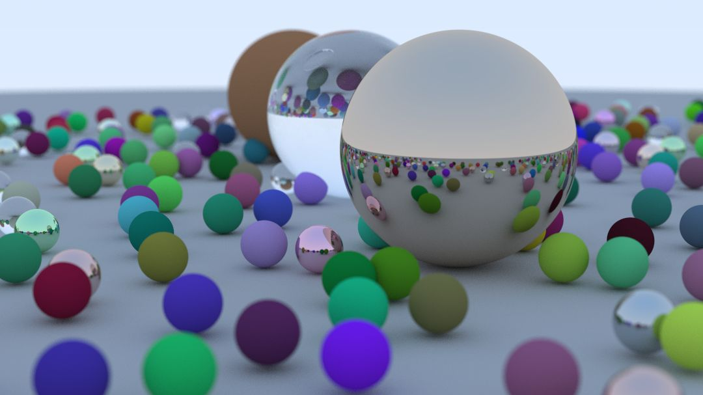

import IntegratedCanvas from "../../components/IntegratedCanvas.astro";
import Caption from "../../components/Caption.astro";
import Aside from "../../components/Aside.astro";
import Diagram1 from "../../assets/bloom/PipelineStages1.svg";
import Diagram2 from "../../assets/bloom/PipelineStages2.svg";
import DiagramRay from "../../assets/bloom/PipelineRayTracing.svg";

# El Trazado de Rayos en un Fin de Semana

Hace unos meses estaba buscando algo que hacer y me encontré con [Ray Tracing in One Weekend](https://raytracing.github.io/books/RayTracingInOneWeekend.html) (El Trazado de Rayos en un Fin de Semana). Parecía algo divertido que me podría mantener entretenido para un rato. Estaba escrita de una manera divertida e interactiva y tenía muchos diagramas e imágenes. Aunque me gusta leer de proyectos interesantes y de las técnicas y tecnología que la gente se inventa, estuvo bien leer un articulo o libro que se podía usar como una base para un proyecto personal sin tener que pasarme horas estudiando el tema. Desgraciadamente, solo está disponible en inglés asi que si quieres leerlo, lo tendrás que o leer en ingles o traducirlo al español. Bueno, con la complicación adicional de querer traducir todo el C++ a Rust, comencé mi aventura con el trazado de rayos ... pero al día siguiente ya tenía problemas.

<Caption>Resultado de «Ray Tracing in One Weekend»</Caption>

Me lo pasé bien leyendo «Ray Tracing in One Weekend» pero no tardé en completarlo. Es cierto que [el resto de la serie](https://raytracing.github.io/) tiene bastante mas contenido per me di cuenta que había algo mas que necesitaba: velocidad. Cada vez que cambiaba algo o añadía algo nuevo, tenía que esperar un buen rato para que el programa produjera la imagen. Esto no tardo en molestar ya que tenía que dejar de trabajar cada dos por tres. Tenía que haber otra manera de hacer todo esto.

<Aside>
	Antes de que me ponga a explicar todo lo que he hecho, quiero disculparme por el rendimiento de esta página. Aún estoy buscando la mejor
	manera de incorporar elementos interactivos en mis páginas web. Si tienes algún problema, pulsa otra vez en los elementos para
	desactivarlos. Y si las visualizaciones no aparecen bien y solo puedes ver un color, asegúrate de que el dispositivo que estés usando
	pueda usar «WebGPU». [Este enlace](http://webgpu.io) a lo mejor te puede ayudar.
</Aside>

# Programación de Gráficos

El motor gráfico que creas con la ayuda del libro solo tiene un hilo por lo tanto le tarda en producir la imagen ya que tiene que procesar cada píxel individualmente, uno por uno. Aunque podría haber modificado el programa para que use el paradigma de multihilo, y para que pueda usar toda la potencia de la CPU en vez de solo una pequeña parte, la mayoría de los ordenadores de hoy en día tienen un componente diseñado para solucionar este tipo de problema - la GPU. La unidad de procesamiento gráfico tiene una arquitectura distinta a la CPU que le facilita el procesamiento en paralelo que significa que es ideal para solucionar problemas que conllevan un alto grado de paralelismo inherente como generar una imagen.

Existe una version del libro que ha sido [modificada para el uso con la GPU en vez de la CPU](https://github.com/RayTracing/gpu-tracing). El problema era que jamás había escrito un programa para la GPU y aún no habían terminado el libro. Me di cuenta de que el motor gráfico del libro estaba escrito usando una biblioteca de Rust llamada [wgpu](https://github.com/gfx-rs/wgpu), entonces decidí aprender como usar wgpu antes de ponerme a trazar rayos de nuevo. Wgpu es una biblioteca popular con bastante documentación (aunque esta toda escrita en ingles). ¡Hasta FireFox lo lleva usando desde la [versión 141](https://mozillagfx.wordpress.com/2025/07/15/shipping-webgpu-on-windows-in-firefox-141/)! Sabiendo todo esto parecía buena idea estudiar wgpu.

Era hora de distraerme de mi proyecto original para aprender wgpu. No tardé en encontrar el tutorial [«Learn Wgpu»](https://sotrh.github.io/learn-wgpu/) que parecía un buen punto de partida. Como era mi primera vez desarrollando una aplicación para la GPU, me costó un poco en acostumbrarme pero me ayudó mucho este tutorial y se lo recomendaría a cualquier persona que también quiera aprender como usar wgpu, aunque solamente esta disponible en inglés.

<IntegratedCanvas id="triangle" colour="navy" />
<Caption>Un triangulo renderizado en la GPU con un fondo que cambia color dependiendo de la posición del ratón</Caption>

Ya que había terminado con mi primera aplicación usando la GPU, era hora de ponerme a trazar rayos una vez más. A lo mejor para la hora que leas esto, el libro del Trazado de Rayos en la GPU estará más completo comparado con cuando lo leí a principios del 2025 y pueda servir como un punto de entrada en vez de tener que seguir otro tutorial para aprender wgpu. De todos modos, con lo que había aprendido, no me tardo en trasladar todo al GPU y crear un moto gráfico muy simple en tiempo real.

<IntegratedCanvas id="gpu-port" colour="salmon" cover="true" />
<Caption>\<\<Ray Tracing in One Weekend\>\> en la GPU</Caption>

## Más Allá del Libro

Costaba mucho más crear una imagen ya que estaba usando una API para aplicaciones con gráficos pero valió la pena al poder ver inmediatamente los resultados de los cambios que le hacía a la aplicación. Tener esta flexibilidad también reveló un mundo de posibilidades para mi motor gráfico, inspirado por el resto de los libros en la serie de «Ray Tracing in One Weekend» y de los videos en YouTube de [Sebastian Lague](https://youtu.be/C1H4zIiCOaI?si=SO4Rt1wgfPHtivY2). Por ejemplo, ¿Y si quiero no solo tener esferas sino también triángulos? - [Möller–Trumbore](https://en.wikipedia.org/wiki/M%C3%B6ller%E2%80%93Trumbore_intersection_algorithm), ¿Que pasa si quiero que los objetos de la escena puedan emitir luz en vez de tener que estar iluminados por el fondo? - materiales emisivos, ¿Me suena esto de un «BVH» pero que es y como funciona? - [¿Que son los BVH?](https://disruptiveludens.wordpress.com/2019/06/15/que-son-los-bvh-explicacion-actuales-y-futuras-implementaciones/), ¿Como hago para que se puedo seleccionar un objeto? - este era un poco más complicado porque tenía que aprender como leer la posición del ratón y que botones este pulsando el usuario, pero una vez que averigüe como hacer esto me permitió añadir controles para la cámara que resultó en una aplicación mucho más interactiva y divertida de usar.

<IntegratedCanvas id="gpu-port-modified" colour="aquamarine" cover="true" />
<Caption>Un motor gráfico con una cámara dinámica, un BVH, materiales emisivos, triángulos, esferas, y profundidad de campo</Caption>

Aunque la escena que creé no estaba sufriendo de problemas de rendimiento, me lo estaba pasando bien leyendo e incorporando maneras de mejorar la velocidad de la aplicación. Esto es la razón por la que le metí el BVH aunque tengo pocos objetos en la escena. El problema era que tenía en mente una mejora que ninguna de la documentación estaba mencionando. El trazado de rayos se ha puesto muy de moda estos últimos años, especialmente cuando te pones a buscar tarjetas gráficas, y yo tengo la suerte de tener una tarjeta gráfica de alta gama que dispone de núcleos dedicados al trazado de rayos. ¿Cómo podía usarlos en mi motor gráfico?

# Vulkan

Lo que yo no sabia en ese momento era que esa pequeña idea me iba a causar más problemas que cualquier otra idea que he tenido en este proyecto. También reveló una cantidad de posibilidades que jamas me va a dar tiempo de explorar totalmente. Cuando me puse a hacer esto, wgpu no era compatible con los núcleos de trazado de rayos entonces tenía que ponerme a buscar otra API gráfica. Inicialmente, quería usar una API que me permitía incrustar la aplicación en una página web, para que sea más fácil enseñárselo a otra gente, pero ninguna de las API compatibles con navegadores web eran compatibles con los núcleos de trazado de rayos. Por lo tanto, era hora de ponerme a investigar las API que usan las aplicaciones de verdad.

Hay tres API de gráficos modernos: DirectX 12, Metal, y Vulkan. OpenGL también es una opción, y el internet tiene muchos recursos y tutoriales para aprender como usarlo, pero los creadores ya no lo están actualizando y no es compatible con las nuevas tecnologías como el trazado de rayos. Una de las razones por la que decidí ponerme a hacer todo esto era que quería aprender cosas nuevas y que sean útiles en el futuro. No tendría sentido aprender un sistema que poco a poco se deja de usar si no tuviese una buena razón. DirectX y Metal son las API diseñadas por Microsoft y Apple para sus plataformas. No se pueden usar en otros sistemas. Como yo uso Windows y Linux, solo me queda una opción: Vulkan. Aplicaciones que usan Vulkan son compatibles con casi cualquier plataforma de hoy en día: Windows, Mac, Linux, Android, iOS, etc. Las plataformas de Apple requieren el uso adicional de [MoltenVK](https://github.com/KhronosGroup/MoltenVK) pero es una extensión oficial de Vulkan y de lo que he leído, parece que funciona bastante bien.

Leí mucho antes de empezar con Vulkan porque quería asegurarme que lo estaba haciendo de manera correcta. No tarde en descubrir que Vulkan es enorme y que suele ser complicado en aprender y crear una aplicación básica. Pero, seguramente la gente estaba exagerando, tan complicado no puede ser. Tenía pensado usar algo como [Vulkano](https://github.com/vulkano-rs/vulkano) para facilitar ciertas cosas pero decidí que si me iba a poner a aprender como usar Vulkan, no debería ponerme a estudiar otra cosa a la misma vez. De todos modos, si me quiero pasar meses estudiando y leyendo documentación, esto es un proyecto personal y puedo hacer lo que me da la gana.

<Aside title="El Triángulo">
	Una cosa que aprendí haciendo todo esto, es que lo equivalente al programa de «¡Hola, Mundo!» en el mundo de las aplicaciones gráficas es
	una imagen de un triángulo. Lo que se me ocurrió es que una manera interesante de comparar distintas API y lenguajes de programación sería
	medir cuanto se tarda en crear esta aplicación o contar cuantos caracteres se necesitan. Hasta uno podría crear un a imagen de Docker y
	comparar el tamaño. Ahora mismo no tengo tiempo para ponerme a explorar esta idea pero a lo mejor en el futuro lo haré. Ahora mismo toca
	descubrir por qué se me ocurrió esta idea.
</Aside>

## Ash

Como quería seguir usando Rust, decidí usar [Ash](https://github.com/ash-rs/ash). Vulkan esta totalmente escrita en C pero está diseñada para poder ser usada en cualquier lenguaje. Khronos, los creadores de Vulkan, ofrecen el archivo [_vk.xml_](https://raw.githubusercontent.com/KhronosGroup/Vulkan-Docs/main/xml/vk.xml) que permite que una aplicación pueda leer la especificación entera de Vulkan y pueda usar esa información para crear una capa para traducirlo todo a cualquier lenguaje que quieras. Esto es lo que es Ash. Te permite acceder la API de Vulkan usando Rust de una manera que puedes seguir usando la documentación y lost tutoriales que están escritas usando C. Una cosa que se tiene tomar en cuenta con esto es que a causa de la manera que esta escrita Vulkan, toda la memoria se tiene que gestionar de manera manual que significa que hay que usar «unsafe Rust», entonces pierdes algunas de las ventajas de estar usando Rust en vez de C o C++.

Necesitaba otro tutorial para empezar con Vulkan. Encontré unos cuantos que la gente solía recomendar pero decidí empezar con [Vulkan Tutorial](https://vulkan-tutorial.com/) escrita por Alexander Overvoorde. Esta escrita en C++ pero con la ayuda de los proyectos de [adrien-ben](https://github.com/adrien-ben/vulkan-tutorial-rs) y de [unknownue's](https://github.com/unknownue/vulkan-tutorial-rust/) logré traducirlo a Rust/Ash. Aunque las funciones de Vulkan son muy similares entre lenguajes distintos, ciertas cosas como controlando la ventana y las entradas del usuario depende mucho del lenguaje y de las bibliotecas que uses y estos proyectos ayudaron mucho con esa parte de la aplicación.

Entonces me puse a crear el triángulo. Cuando empecé creando imágenes en la CPU, en como una hora ya tenía una imagen con un triangulo, y cuando me puse a usar wgpu, me tardó casi un día. Con Ash estuve una semana entera trabajando antes de poder producir una imagen. Aunque me resultó bastante más difícil, explorando este nuevo mundo de los procesadores gráficos fue muy interesante y me emocionó mucho ver el triángulo después de haber estado trabajando tanto tiempo. El tutorial también te enseña como crear una escena 3D con iluminación
básica, texturas, y un objeto importado, pero esto no me servía mucho para lo que quería hacer.

Al terminar el tutorial, tenía mi propia aplicación de Vulkan. Le faltaban características pero me servía como un punto de partida y no me resultó demasiado difícil modificar los sombreadores del motor gráfico escrito con wgpu para que funcionen con el de Vulkan. Un detalle curioso de Vulkan es que no tiene su propio lenguaje de sombreador. Las otras API de gráficos todos tienen su propio lenguaje (DirectX tiene HLSL, Metal tiene MSL, OpenGL con GLSL, WebGPU con WGSL, etc.) pero Vulkan tiene un formato binario intermedio llamado [SPIR-V](https://www.khronos.org/spirv/) (Representación Intermedia Portátil Estándar). Esto te permite usar cualquier lenguaje que quieras y compilarlo a SPIR-V para que sea compatible con Vulkan. Para este proyecto, decidí continuar usando mis sombreadores escritas en WGSL, con pequeñas modificaciones.

# Trazado de Rayos Acelerado

Aunque estaba trazando rayos de nuevo, aún no estaba usando los núcleos dedicados al trazado de rayos. Me costo bastante averiguar como hacer esto y paso de explicarlo en detalle entonces aquí tienes un pequeño resumen de lo que aprendí.

## VK_KHR_ray_tracing_pipeline

La API de Vulkan esta dividida entre las características fundamentales «core» y las adicionales «extensions». Todos los dispositivos que son compatibles con Vulkan **deben** ser compatibles con todas las características fundamentales de la version de Vulkan que estén usando y pueden tener cualquier características adicionales ([La especificación de Vulkan](https://docs.vulkan.org/spec/latest/appendices/extensions.html)). El Khronos Group (los desarrolladores de Vulkan) tiene sus propias características adicionales denominadas con el prefijo **KHR\_** y también tienen las características adicionales de múltiples proveedores con **EXT\_**, pero cualquier persona u organización puede añadir sus propias características adicionales. Por ejemplo, Nvidia tiene **NV\_**, Google tiene **GOOGLE\_**, y AMD tiene **AMD\_**. Si los miembros del Khronos Group creen que una característica adicional publicada por una organización tiene valor que sea adoptada por más gente, lo pueden publicar de nuevo como un característica **EXT\_**, y luego si se determina que la mayoría de las plataformas son compatibles con las característica y no causa problemas con ninguna otra característica oficial, lo pueden [publicar otra vez como una característica oficial](https://docs.vulkan.org/spec/latest/chapters/introduction.html#introduction-ratified) **KHR\_**. Finalmente, los miembros pueden decidir que quieren votar para [convertir la característica adicional en una fundamental](https://docs.vulkan.org/spec/latest/chapters/extensions.html#extendingvulkan-compatibility-extensions), que significa que todas las futuras versiones de Vulkan tendrán esa característica. No siempre es así de fácil ya que una característica puede salir de la nada en cualquier nivel, dependiendo de como de importante creen los miembros que sea, pero más o menos suele funcionar así.

Cuando me puse a hacer todo esto, el trazado de rayos en Vulkan era una característica adicional oficial (**KHR**). A lo mejor sigue así o han cambiado algo. Vulkan tiene dos maneras de trazar rayos: la tubería de trazado de rayos _VK_KHR_ray_tracing_pipeline_ (que se suele usar para crear una imagen completa), y la consulta de trazado de rayos _VK_KHR_ray_query_ (que sirve para trazar pocos rayos a la vez). Ambas de estas maneras requieren el uso de la Estructura de Aceleración _VK_KHR_acceleration_structure_. La Estructure de Aceleración es fundamental a como funciona el trazado de rayos en tiempo real y cada proveedor de GPU tiene su propia implementación secreta ya que afecta mucho el rendimiento del trazado de rayos. Leí [un artículo analizando las diferentes implementaciones](https://zeux.io/2025/03/31/measuring-acceleration-structures/) que me resultó interesante aunque me costó entenderlo todo. El «BVH» [que mencioné antes](#beyond-the-book) es una versión muy simple de una estructura de aceleración pero básicamente es una estructura de datos que permite que la GPU pueda decirnos so un rayo a impactado algún objeto, sin tener que comprobar cada objeto de la escena.

## La Tubería de Renderizado del Trazado de Rayos

Mi motor gráfico originalmente trazaba los rayos en el sombreador de fragmento y el sombreador de vértice creaba una rectángulo que cubre la pantalla. Esto es lo único que necesitas para mostrar una imagen. Cada vez que el ordenador quiera repintar la ventana, la GPU ejecuta el sombreador de vértice para crear el rectángulo y luego el sombreador de fragmento para colorearlo. Si el rectángulo cubre la pantalla entera, el usuario ve la imagen que hemos creado. Esta solución es muy sencilla porque la GPU solo tiene que estar haciendo una cosa a la vez: o el sombreador de vértice o el de fragmento.

<Diagram1 width={"100%"} height={"100%"} />

<Caption Padding="0">Las etapas de mi tubería de renderizado de gráficos</Caption>

El problema es que los núcleos de trazado de rayos no pueden ser accedidos desde las etapas tradicionales. La etapa de trazado de rayos es una que tiene que estar configurada y ejecutada por separado. En mi caso, esta etapa usa la estructura de aceleración para crear una imagen que contiene lo que ve la cámara. El sombreador de fragmento puede usar esta imagen para mostrarla en las vértices que el sombreador de vértice ha creado, que significa que el usuario podrá verla. Aunque en principio, es posible configurar la GPU para que la etapa de trazado de rayos sea incorporada con las etapas tradicionales, tenemos que explorar otro tema.

<Aside title="El Cómputo en Paralelo">
	Si entiendes como las CPU usan la técnica de multihilo, las GPU pueden hacer algo similar con un _queue_ (la traducción literal sería cola
	o fila per no pude encontrar si existe una traducción en este contexto). Esto permite que más de un trabajo puede ser ejecutado en
	paralelo, aunque no todas las GPU pueden ejecutar más de una cosa a la vez. Cada _queue_ consiste en una lista de comandos que quieres que
	la GPU ejecute una tras otro. Por ejemplo, la etapa tradicional usa un _queue_ para generar las vértices, pintarlas con el sombreador de
	fragmento, y luego mostrarlo en la pantalla. Pero este _queue_ está limitado para que solo ocurra una vez cada cuadro. ¿Y si queremos
	ejecutar algo más de una vez por cuadro?
</Aside>

Los sombreadores de cómputo te dejan ejecutar lo que quieras en la GPU. Si no existe ya una etapa o sombreador para lo que quieras hacer, lo puedes meter en el de cómputo. Por ejemplo, si quieres diseñar un motor de física en la GPU, lo pondrías en un sombreador de cómputo. Pero los motores de física deberían ser independientes del FPS del motor gráfico. Lo ideal sería que deberían ser ejecutados cada x milisegundos (el valor exacto puede variar mucho y depende de muchas cosas incluyendo el diseño del motor). Esto no es posible si forma parte del _queue_ que contiene la etapa tradicional.

Con dos (o más) _queues_ podemos ejecutar varios trabajos en la GPU en paralelo. Esto nos permite hacer cosas en la GPU sin estar limitados por el FPS. El problema es que esto complica el diseño de la aplicación ya que hay que asegurarse de que todas las variables que se comparten entre _queues_ solo sean usadas por un _queue_ a la vez y que estén siempre en el estado correcto. Se vuelve aún más complejo si la CPU tiene multiples hilos que estén usando las variables.

Decidí que quería que el trazado de rayos de mi motor gráfico tenga su propio _queue_. Esto permitiría que el trazado de rayos podría ocurrir más de una vez por cuadro (en sistema con tarjetas gráficas de alta gama) o multiples cuadros podrían usar la misma imagen y manipularla (como lo hace nvidia reflex o lo explica [este video de 2kliksphilip](https://youtu.be/f8piCZz0p-Y?si=NsE2D7Vk3Jw4bcdS)) manteniendo el efecto de tener un FPS alto. Para poder hacer todo esto, necesitaba modificar mi motor gráfico para que sea un sombreador de cómputo en vez de uno de fragmento.

<Diagram2 width={"100%"} height={"100%"} />

<Caption Padding="0">Dos _queues_ operando en paralelo con sus propias etapas de la tubería de renderizado</Caption>

Con este cambio de arquitectura ya casi estaba listo para usar los núcleos dedicados al trazado de rayos. Lo único que faltaba era crear la estructura de aceleración y averiguar como meterle los objetos de la escena que ya tenía.

## Estructuras de Aceleración

Vulkan tiene dos tipos de estructuras de aceleración: las estructuras de aceleración de nivel superior (TLAS - _Top Level Acceleration Structure_) y las de nivel inferior (BLAS - _Bottom Level Acceleration Structure_). Me costó un poco entender como funcionan per intentaré explicarlo. Cada objeto de la escena tiene su propia BLAS y la escena en si esta compuesta de un TLAS que contiene todas las BLAS. Con la característica de trazado de rayos **KHR**, la BLAS puede contener o un modelo compuesto de triángulos o una caja delimitadora alineado al eje (AABB). En el libro _Ray Tracing in One Weekend_, todos los objetos son esferas perfectas (en vez de estar compuesta de triángulos) y esto no es una opción que nos proporciona la característica oficial del trazado de rayos. Afortunadamente, no nos tenemos que preocupar ya que podemos usar cajas delimitadoras. Con las AABB, le describes a la GPU más o menos donde está tu objeto, y la GPU te permite describir la posición exacta en un sombreador. O sea, si hay una colisión entre un rayo y la AABB, la GPU ejecutará tu sombreador donde describirías si realmente hubo un a colisión entre el rayo y el objeto, y si sí hubo, como se refleja o absorbe el rayo. Esto significa que el sombreador que he estado usando no se tiene que modificar mucho para incorporarlo en este sistema ya que las colisiones ya las estaba calculando a mano. También nos permite añadir una gran variedad de objetos en el futuro como lentes, cápsulas, agua, nubes, humo, etc.

Una dato curioso con las estructuras de aceleración es que tanto las TLAS como las BLAS contienen una matriz de transformación para cada objeto, así que puedes tener varios objetos con la misma BLAS pero distintas posiciones, mejorando el rendimiento si usas un objeto muchas veces en la misma escena.

## Sombreadores de Trazado de Rayos

Con la estructura de aceleración hecha, solo faltaba escribir los sombreadores nuevos. Normalmente, el trazado de rayos se divide en cuatro etapas por los que tiene que pasar cada rayo: la generación del rayo (o _ray generation_), la intersección (o _intersection_), y por último la colisión (_hit_) o el fondo (_miss_). En mi aplicación anterior, lo que tenía era todos estas etapas en un sombreado y calculando las transiciones entre cada una yo mismo. Cuando se esta usando el núcleo de trazado de rayos, la GPU se encarga de todas las transiciones, solo se le tiene que dar el sombreador de cada etapa y los ejecutará cuando es hora.

<DiagramRay width={"100%"} height={"100%"} />

<Caption Padding="0">Tubería simple de trazado de rayos con núcleos especializados</Caption>

Un pequeño resumen de las etapas del trazado de rayos y como los estamos usando:

- **Generación de Rayos** - Se ejecuta una vez por imagen. Usando la posición y configuración de la cámara y la resolución de la pantalla, dispara una serie de rayos en varias direcciones. Cada rayo representa la luz que le llega a cada píxel de la cámara. Cuando todas las colisiones hayan sido calculadas, esta etapa calcula el color de cada píxel.
- **Intersección** - Ejecutada cada vez que haya una colisión entre un rayo y una caja delimitadora (AABB). Aquí le decimos a la GPU si realmente hubo una colisión con el objeto. La GPU luego puede decidir si esto fue el objeto más cercano a la cámara o si realmente hubo una colisión con otro objeto.
- **Fondo** - Ejecutada por cada rayo que no tiene ninguna intersección. Aquí es donde describimos el fondo de la escena. Ahora mismo estoy usando una textura del cielo pero podrías tener algo más sofisticado.
- **Colisión** - Ejecutada por la colisión mas cercana de cada rayo. Aquí se le da color al rayo dependiendo del objeto y también se pueden crear nuevos rayos para cuando haya reflejos.

# Motor de Videojuego

Pues ya esta. Unos cuantos meses de trabajo creando un motor gráfico empezando con el libro _Ray Tracing in One Weekend_ y luego modificándolo para que use los núcleos dedicados al trazado de rayos de mi GPU, añadiéndole más y más cosas poco a poco. Pero aún no estoy satisfecho. Tengo una aplicación muy básica pero con cada tema que me ponía a estudiar, se me ocurrían más y más ideas para meterle. Ahora lo que quiero hacer es un motor de videojuego. No quiero hacer nada tan complejo como Unity, Unreal, o Godot, pero quiero tener un sitio donde puedo experimentar con nuevas tecnologías e ideas. Lo que tengo planeado ahora mismo es implementar todas las características fundamentales de un motor de videojuego: gráficos, un motor de físicas, sonido, IU, y un sistema multijugador. A lo mejor le meteré más cosas si no resulta ya lo suficientemente difícil pero creo que con esto tengo suficiente trabajo para entretenerme el resto de mi vida. Tengo varias ideas para juegos que se podrían hacer con el motor de videojuego que tengo en mente (y a lo mejor os contaré más en el futuro) pero al fin y al cabo creo que me resulta más interesante la tecnología involucrada en crear videojuegos que los videojuegos en si entonces dudo que algún dįa sea capaz de crear un videojuego en condiciones.

Si quieres ver lo que he hecho o le que estoy haciendo, el proyecto Bloom está en [GitHub](https://github.com/roberto-holmes/bloom) y a lo mejor funciona en tú ordenador. Ahora mismo solo tengo un juego _muy_ básico donde tienes que navegar un laberinto de espejos pero espero que en el futuro pueda hacer algo más interesante, siempre que tenga tiempo de dedicarme a esto. Y a lo mejor escribiré más de estos artículos con lo que descubro.
